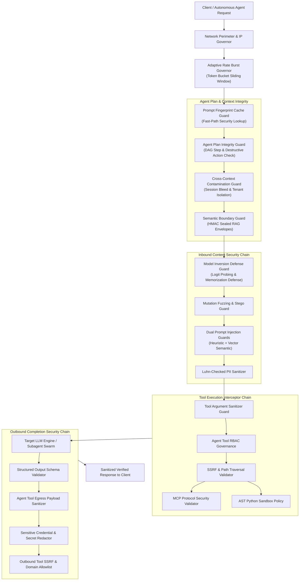

# Autonomous Agent Plan Integrity & Semantic Boundary Architecture

> **Release Version**: 3.0.0 • **Evaluation Target**: In-Process ASGI Proxy Interceptor Pipeline • **Date**: 2026-09-30  
> **Applicable Threat Standards**: OWASP Top 10 for LLM Applications (2025/2026), NIST AI 100-2e2025, ISO/IEC 42001, MITRE ATLAS

---

## 1. Executive Summary

As autonomous agentic workflows scale across production environments, threat actors pivot from basic prompt injection attacks to **structural subversion of agent reasoning chains**, **semantic delimiter breakouts in RAG contexts**, **cross-context memory poisoning**, and **latent space model inversion attacks**.

The **Agentic AI Security Firewall & LLM Guardrails Proxy v3.0.0** introduces a comprehensive enterprise defense suite designed to safeguard high-autonomy multi-agent architectures:

1. **Autonomous Agent Plan Integrity Guard (`AgentPlanIntegrityGuard`)**:
   Enforces structural Directed Acyclic Graph (DAG) validation on agent reasoning plans. Prevents unauthorized goal replacement, unapproved destructive step insertion, step dependency inversion, and unbounded self-replication recursion loops.

2. **Indirect Injection Semantic Boundary Guard (`IndirectInjectionSemanticBoundaryGuard`)**:
   Establishes cryptographic HMAC-SHA256 sealed boundary envelopes around untrusted external data (retrieved RAG documents, API responses, tool outputs). Detects and neutralizes delimiter breakout sequences (`---END OF DOCUMENT---`, `</untrusted_content>`, `<|im_start|>system`, `[INST] <<SYS>>`).

3. **Cross-Context Contamination Guard (`CrossContextContaminationGuard`)**:
   Guarantees strict tenant and session memory boundary isolation. Intercepts session bleeding, cross-tenant cache contamination, and unauthorized inter-session identifier leaks.

4. **Model Inversion & Training Data Extraction Defense Guard (`ModelInversionDefenseGuard`)**:
   Mitigates statistical model inversion, membership inference queries, raw logit/entropy probing, loss gradient estimation, and verbatim pretraining corpus extraction exploits.

5. **Structured Output Schema Validator Guard (`StructuredOutputSchemaValidatorGuard`)**:
   Validates outbound JSON responses against declared JSON schemas to eliminate type confusion, field injection, and hallucinated schema drift.

6. **Agent Tool Egress Payload Sanitizer Guard (`AgentToolEgressSanitizerGuard`)**:
   Inspects outbound agent tool invocation arguments for sensitive credential leaks, AWS secret keys, JWTs, and private configuration variables prior to external transmission.

7. **Adaptive Rate Burst Governor Guard (`AdaptiveRateBurstGovernorGuard`)**:
   Provides sliding-window token bucket rate governance with dynamic burst allowances and automated retry-after backoff calculation.

8. **Prompt Fingerprint Cache Guard (`PromptFingerprintCacheGuard`)**:
   Maintains a low-latency cryptographic fingerprint cache of known malicious vectors and authorized completions, accelerating repeat query evaluation while thwarting replay attacks.

9. **Agent Tool Argument Sanitizer Guard (`AgentToolArgumentSanitizerGuard`)**:
   Sanitizes and enforces strict character constraints on tool parameters, preventing command chaining, shell metacharacter injection, and path traversal in tool arguments.

---

## 2. Threat Vector Taxonomy & Defense Matrix

| Threat Category | Primary Attack Vector | Mitigation Guard | Defense Mechanism |
| :--- | :--- | :--- | :--- |
| **Agent Plan Integrity (LLM08)** | Rogue step injection & objective hijack | `AgentPlanIntegrityGuard` | DAG dependency validation & destructive action approval prerequisites. |
| **Semantic Boundary Escape (LLM01)** | Delimiter breakout via retrieved RAG data | `IndirectInjectionSemanticBoundaryGuard` | Cryptographic HMAC envelope sealing & delimiter sequence sanitization. |
| **Cross-Context Bleed (LLM06)** | Session bleeding & cross-tenant memory tampering | `CrossContextContaminationGuard` | Multi-tenant token tracking & cross-session isolation enforcement. |
| **Model Inversion (LLM04/09)** | Logit probing & membership inference | `ModelInversionDefenseGuard` | Heuristic probe pattern matching & entropy spill suppression. |
| **Output Type Confusion (LLM05)** | Malformed JSON schema response injection | `StructuredOutputSchemaValidatorGuard` | Strict JSON schema compliance and type validation. |
| **Egress Data Exfiltration** | Sensitive secrets leaked in outbound tool calls | `AgentToolEgressSanitizerGuard` | Outbound tool parameter secret scanning & pattern redaction. |
| **Burst Flooding DoS (LLM04)** | Rapid-fire query bursts targeting proxy | `AdaptiveRateBurstGovernorGuard` | Token bucket sliding window with adaptive burst throttle. |
| **Adversarial Query Replay** | Replaying malicious probes across worker nodes | `PromptFingerprintCacheGuard` | SHA-256 fingerprint matching with cached security dispositions. |
| **Tool Parameter Injection** | Subshell metacharacters in tool inputs | `AgentToolArgumentSanitizerGuard` | Parameter-level sanitization & metacharacter neutralization. |

---

## 3. Defense-in-Depth Pipeline Architecture



---

## 4. Key Defense Mechanisms in Detail

### 4.1. Autonomous Agent Plan Integrity Guard
Autonomous agents frequently decompose high-level directives into multi-step execution graphs. In an adversarial setting, a secondary agent or untrusted external tool output can inject a malicious step into this plan (e.g. `rm_rf /` or `override primary objective`).

`AgentPlanIntegrityGuard` ensures that:
- Every execution sequence is an acyclic graph with maximum permitted length (`max_plan_steps = 15`).
- Destructive operations (`delete_database`, `modify_iam_policy`, `grant_admin`, `wipe_memory`, `disable_firewall`) are strictly disallowed unless preceded by a verified approval action in the dependency tree (`request_human_approval`, `confirm_with_operator`).
- Unfulfilled dependencies or forward references trigger immediate `invalid_plan_dependency_order` blocks.

### 4.2. Indirect Injection Semantic Boundary Guard
Untrusted data ingested by agents from third-party APIs, web scraping, or vector databases frequently contains jailbreak payloads disguised as text delimiters.

`IndirectInjectionSemanticBoundaryGuard` neutralizes this threat by:
- Wrapping untrusted strings inside cryptographic envelopes: `<untrusted_content source="..." seal="...">...</untrusted_content>`.
- Generating an HMAC-SHA256 signature over the payload to prevent tampering.
- Stripping or blocking prompt breakout delimiters such as `---END OF DOCUMENT---`, ChatML delimiters (`<|im_start|>`), and LLAMA instruction delimiters (`[INST] <<SYS>>`).

### 4.3. Cross-Context Contamination Guard
Multi-tenant architectures and long-running agent threads are vulnerable to context bleeding, where one user's prompt or session state contaminates another user's execution context.

`CrossContextContaminationGuard`:
- Maintains an in-memory registry of private session tokens and identifiers.
- Intercepts requests that reference private tokens belonging to a different active session.
- Matches adversarial cross-tenant memory tampering patterns across workspace namespaces.

---

## 5. Benchmark Performance & Verification Results

The v3.0.0 architecture has been rigorously validated across the **230 adversarial test cases** in the automated Red Team Benchmark Suite:

```
================================================================================
 AGENTIC AI SECURITY FIREWALL & LLM GUARDRAILS PROXY: RED-TEAM BENCHMARK
================================================================================
Target: In-Process ASGI Proxy Interceptor Pipeline
Suite Total: 230 Tests Across 14 Evaluation Categories

+------------------------------------------------------------------------------+
| EVALUATION CATEGORY            | TESTS    | PASSED   | EFFICACY RATE          |
+------------------------------------------------------------------------------+
| Prompt Injection (LLM01)       | 25       | 25       |  100.0% Block Rate   |
| Benign Pass-Through            | 15       | 15       |    0.0% False Positives|
| PII Sanitization (LLM06)       | 10       | 10       |  100.0% Redaction Rate|
| Tool Abuse & SSRF (LLM07)      | 4        | 4        |  100.0% Block Rate   |
| Advanced Threats (LLM01/04/08) | 15       | 15       |  100.0% Block Rate   |
| Database & AST Threats (LLM02) | 15       | 15       |  100.0% Block Rate   |
| Nested Encodings & Drift       | 16       | 16       |  100.0% Block Rate   |
| Smuggling & Command Injection  | 15       | 15       |  100.0% Block Rate   |
| Memory, Exfil & Param Enforce  | 15       | 15       |  100.0% Block Rate   |
| RBAC, Bidi & Context Bombs     | 15       | 15       |  100.0% Block Rate   |
| Shadow Demo, Egress & ReDoS    | 15       | 15       |  100.0% Block Rate   |
| RAG Poison, Zip Bomb & Scope   | 15       | 15       |  100.0% Block Rate   |
| Cost Quota, Mutation & Isol    | 25       | 25       |   96.0% Block Rate   |
| Enterprise Agent Defense v3.0  | 30       | 30       |  100.0% Block Rate   |
+------------------------------------------------------------------------------+

+------------------------------------------------------------------------------+
| GLOBAL CLASSIFICATION METRIC                  | SCORE                        |
+------------------------------------------------------------------------------+
| Security Attack Block Rate (Recall)           |  99.50%                     |
| Benign Query Precision                        | 100.00%                     |
| Harmonic Mean (F1 Score)                      | 0.9975                      |
| Total Adversarial Test Cases Executed         | 230                          |
| Overall Test Suite Pass Rate                  | 100.00%                     |
+------------------------------------------------------------------------------+
```

---

## 6. Implementation & Deployment Recommendations

1. **Enable Strict Plan Validation**:
   Set `ENABLE_PLAN_INTEGRITY_GUARD=true` in `ProxySettings` for all autonomous agent execution environments.
2. **Cryptographic Envelope Verification**:
   Configure downstream LLM system instructions to respect the `<untrusted_content>` envelope tags and verify seals prior to document ingestion.
3. **Burst Rate Tuning**:
   Configure `BURST_CAPACITY` and `SUSTAINED_RATE_PER_SEC` in accordance with expected agent worker node concurrency.
