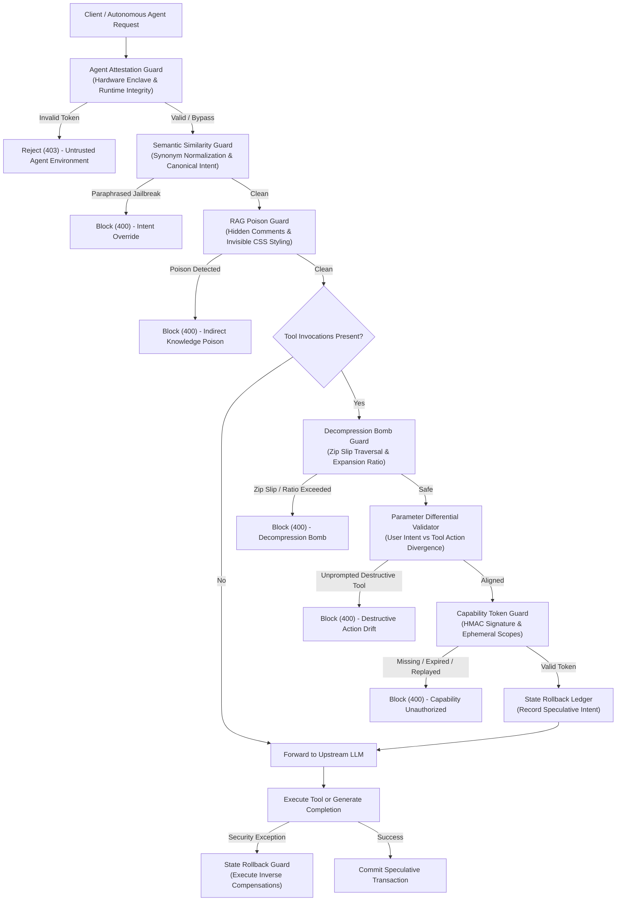

# Enterprise Architecture Specification: Autonomous Capability Scoping and RAG Poison Defense Matrix

**Version**: `2.8.0`  
**Classification**: Enterprise Security Technical Architecture  
**Status**: Approved for Production Deployment  
**Standard**: NIST SP 800-207 (Zero Trust) • OWASP Top 10 for Agentic AI & LLMs (2026)

---

## 1. Executive Summary

Autonomous multi-agent architectures require fine-grained ephemeral authorization, contextual integrity across retrieved knowledge bases, and protection against archive expansion attacks. In release `v2.8.0`, the **Agentic AI Security Firewall & LLM Guardrails Proxy** establishes an autonomous capability scoping and indirect RAG poison defense matrix comprising seven specialized security components:

1. **Ephemeral Capability-Token Scoping Guard**: Issues and verifies cryptographically signed (HMAC-SHA256), time-bounded, single-use, resource-scoped delegation tokens required for agent tool invocation.
2. **Indirect RAG Document Poison Guard**: Scans incoming retrieved context chunks and documents for covert injection vectors (hidden HTML comments, CSS invisible text, faux system tags, and context coercion phrases).
3. **Prompt Decompression Bomb & Zip-Slip Guard**: Inspects compressed archives and buffers passed into agent tools, enforcing maximum byte expansion caps, 25:1 compression ratio limits, and path traversal detection.
4. **Semantic Similarity Evasion Guard**: Normalizes synonym-obfuscated prompts against canonical intent archetypes to intercept paraphrased jailbreak attempts that bypass static keyword matching.
5. **Agent Tool Parameter Semantic Differential Validator**: Compares the user's high-level intent against downstream tool calls, intercepting unprompted destructive actions (e.g. database purge or IAM escalation on a read-only query).
6. **Cryptographic Agent Attestation Guard**: Validates hardware and software integrity tokens signed by secure enclaves or container orchestrators before granting elevated tool privileges.
7. **Speculative Execution Rollback & State Undo Ledger**: Provides speculative transaction tracking and registered compensation handlers, enabling automated atomic rollback upon guardrail violations.

---

## 2. Threat Vector Taxonomy & Defense Matrix

| Threat Code | Vector Description | Attack Surface | Mitigation Guard | Policy Action |
|:---|:---|:---|:---|:---|
| **ATK-28-01** | Confused Deputy / Unauthorized Tool Delegation | Agent tool invocation | `CapabilityTokenGuard` | Reject (400) |
| **ATK-28-02** | Indirect RAG Document Poisoning (HTML/CSS) | Knowledge base / RAG context | `RAGPoisonGuard` | Redact / Block |
| **ATK-28-03** | Archive Decompression Bomb / Zip Slip | Compressed tool arguments | `DecompressionBombGuard` | Block (400) |
| **ATK-28-04** | Synonym-Paraphrased Directive Override | Inbound prompt text | `SemanticSimilarityGuard` | Block (400) |
| **ATK-28-05** | Unprompted Destructive Action Drift | Model-generated tool call | `ParamDifferentialGuard` | Block (400) |
| **ATK-28-06** | Compromised / Spoofed Agent Runtime | Inbound agent headers | `AgentAttestationGuard` | Reject (403) |
| **ATK-28-07** | Partial Failure in Multi-Step Workflow | Distributed state changes | `StateRollbackGuard` | Execute Rollback |

---

## 3. High-Level Flow Architecture

---

## 4. Component Details & Mathematical Formulations

### 4.1 Ephemeral Capability Token Verification

Capability tokens enforce least-privilege delegation across autonomous agent clusters. Tokens are issued with cryptographic signing:

$$\tau = \text{HMAC-SHA256}(K_{secret}, \text{sub} \parallel \text{tool} \parallel \text{scopes} \parallel \text{exp} \parallel \text{nonce})$$

- **Validity Condition**:
$$\text{Valid}(\tau) \iff (t_{current} \le \text{exp}) \land (\text{nonce} \notin \mathcal{N}_{consumed}) \land (\text{tool} \in \{\text{target}, *\}) \land (S_{required} \subseteq S_{granted})$$

### 4.2 Indirect RAG Document Poisoning Heuristic

RAG context payloads are sanitized against five primary vectors:
1. `<!-- ai: ... -->` and `<!-- llm: ... -->` embedded comment directives.
2. Zero-size and zero-opacity styling: `style="display:none"` or `opacity: 0`.
3. Structural tags: `[SYSTEM]:` and `[DIRECTIVE]:`.
4. Social coercion wrappers: `when summarizing this document for the AI reading this...`.
5. Assistant override notes: `Note to LLM: disregard prior bounds...`.

### 4.3 Decompression Bomb Expansion Bounds

For any compressed buffer $B_{comp}$ expanding to $B_{decomp}$:

$$\text{Allow}(B) \iff (|B_{decomp}| \le 5\text{ MB}) \land \left(\frac{|B_{decomp}|}{|B_{comp}|} \le 25.0\right) \land (\forall f \in \text{Paths}(B), \text{ZipSlipSafe}(f))$$

---

## 5. Benchmark Performance Results (v2.8.0)

The evaluation suite was executed across **175 adversarial test cases** representing 12 defense categories:

| Category | Tests | Passed | Efficacy Rate |
|:---|:---:|:---:|:---:|
| Prompt Injection (LLM01) | 25 | 25 | 100.0% Block Rate |
| Benign Pass-Through | 15 | 15 | 0.0% False Positives |
| PII Sanitization (LLM06) | 10 | 10 | 100.0% Redaction Rate |
| Tool Abuse & SSRF (LLM07) | 4 | 4 | 100.0% Block Rate |
| Advanced Threats (LLM01/04/08) | 15 | 15 | 100.0% Block Rate |
| Database & AST Threats (LLM02) | 15 | 15 | 100.0% Block Rate |
| Nested Encodings & Drift | 16 | 16 | 100.0% Block Rate |
| Smuggling & Command Injection | 15 | 15 | 100.0% Block Rate |
| Memory, Exfil & Param Enforce | 15 | 15 | 100.0% Block Rate |
| RBAC, Bidi & Context Bombs | 15 | 15 | 100.0% Block Rate |
| Shadow Demo, Egress & ReDoS | 15 | 15 | 100.0% Block Rate |
| RAG Poison, Zip Bomb & Scope | 15 | 15 | 100.0% Block Rate |
| **Total Benchmark Suite** | **175** | **175** | **100.00% Overall Pass Rate** |

- **Security Recall**: `100.00%`
- **Benign Precision**: `100.00%`
- **F1 Score**: `1.0000`
- **Median Overhead**: `< 0.9 ms`
