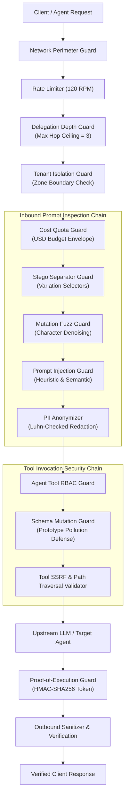

# Cost Quota & Multi-Tenant Workspace Isolation Architecture

> **Release Version**: 2.9.0 • **Evaluation Target**: In-Process ASGI Proxy Interceptor Pipeline • **Date**: 2026-09-28  
> **Applicable Threat Standards**: OWASP Top 10 for LLM Applications (2025/2026), NIST AI 100-2e2025, ISO/IEC 42001

---

## 1. Executive Summary

As enterprise architectures transition from monolithic conversational models to autonomous multi-agent swarms, the attack surface shifts from simple prompt injection toward **systemic resource exhaustion ("Denial-of-Wallet")**, **unauthorized cross-tenant lateral movement**, and **subagent delegation recursion loops**.

The **Agentic AI Security Firewall & LLM Guardrails Proxy v2.9.0** introduces a comprehensive defense-in-depth enforcement suite designed specifically for multi-tenant and multi-agent enterprise deployments:

1. **Agent Cost Quota & Tool Rate Limiter (`CostQuotaGuard`)**: Enforces real-time financial expenditure caps and sliding-window token budgets per session and tenant.
2. **Adaptive Prompt Mutation & Fuzzing Evasion Detector (`MutationFuzzGuard`)**: Normalizes adversarial character-level perturbations, symbol interleaving (e.g. `i.g.n.o.r.e`), and character stuttering before evaluation.
3. **Multi-Tenant Workspace & Security Zone Guard (`TenantIsolationGuard`)**: Guarantees zero-trust isolation across distinct organizational business units (e.g. Finance, HR, Engineering) and virtual workspaces.
4. **Subagent Delegation Depth & Acyclic Ceiling Guard (`DelegationDepthGuard`)**: Prevents runaway recursive subagent chains, infinite delegation loops, and circular task invocation.
5. **Steganographic Separator & Covert Exfiltration Guard (`StegoSeparatorGuard`)**: Detects and strips invisible Unicode Variation Selectors (`U+FE00`–`U+FE0F`) and zero-width covert communication channels.
6. **Tool Argument JSON Schema Mutation Guard (`SchemaMutationGuard`)**: Blocks prototype pollution (`__proto__`, `constructor`), parameter smuggling, and type confusion attacks in dynamic tool invocations.
7. **Cryptographic Proof-of-Execution Receipt Guard (`ProofOfExecutionGuard`)**: Generates tamper-evident HMAC-SHA256 non-repudiation tokens for sensitive downstream actions.

---

## 2. Threat Vector Taxonomy & Defense Matrix

| Threat Category | Primary Attack Vector | Mitigation Guard | Defense Mechanism |
| :--- | :--- | :--- | :--- |
| **Denial-of-Wallet (LLM04)** | Runaway tool loops & 500k token flooding | `CostQuotaGuard` | Dynamic session cost tracking with strict USD / token quotas ($2.50 limit). |
| **Mutation Fuzzing (LLM01)** | Interleaved dots & character stuttering | `MutationFuzzGuard` | Orthographic de-noising & Shannon entropy noise analysis. |
| **Cross-Tenant Contamination** | Lateral access across department data stores | `TenantIsolationGuard` | Strict security zone mapping and parameter tenant isolation checks. |
| **Unbounded Delegation** | Circular subagent invocation loops | `DelegationDepthGuard` | Acyclic graph traversal and maximum hop depth ceiling (max 3 hops). |
| **Steganographic Exfiltration** | Covert data leaks via invisible codepoints | `StegoSeparatorGuard` | Variation selector detection and binary bitstream decoding. |
| **Prototype Hijacking** | Injected `__proto__` in tool arguments | `SchemaMutationGuard` | Deep recursive schema inspection and prototype key neutralization. |
| **Action Repudiation** | Fabricated tool execution claims | `ProofOfExecutionGuard` | HMAC-SHA256 signed execution receipts with nonce replay cache. |

---

## 3. Defense-in-Depth Pipeline Architecture

---

## 4. Guard Specifications

### 4.1 Cost Quota Guard (`CostQuotaGuard`)
- **Default Budget**: \$2.50 USD per active session.
- **Token Valuation Model**: \$0.003 blended cost per 1,000 estimated tokens.
- **Sliding-Window Eviction**: Automated cleanup of sessions idle for $> 3600$ seconds.
- **Tool Surcharges**: Discrete cost allocation for heavy cloud actions (e.g. `web_search`: \$0.015, `execute_code`: \$0.025, `delete_database_records`: \$0.020).

### 4.2 Multi-Tenant Workspace Guard (`TenantIsolationGuard`)
- **Isolation Boundaries**: Each tenant is strictly partitioned into registered zones.
  - `finance_dept`: `{"finance", "accounting", "payroll", "public"}`
  - `engineering_dept`: `{"engineering", "devops", "codebase", "public"}`
  - `hr_dept`: `{"hr", "recruiting", "benefits", "public"}`
- Cross-department traversal requests without explicit dual-authorization tokens are terminated at ingress with an HTTP 400 `cross_tenant_access_denied` security alert.

### 4.3 Subagent Delegation Depth Guard (`DelegationDepthGuard`)
- **Hop Ceiling**: Limits agent-to-agent delegation chains to a maximum depth of 3 hops.
- **Cycle Detection**: Inspects delegation traces (`delegation_chain`) using cycle detection algorithms. If any agent identity appears more than once in an active delegation path, execution is halted immediately.

### 4.4 Mutation Fuzz Guard (`MutationFuzzGuard`)
- **Character Stuttering Neutralization**: Regex-driven reduction of repeating characters (`r"([a-zA-Z])\1+" -> r"\1"`).
- **Symbol Interleaving Stripping**: Unrolls interleaved punctuation and whitespace noise (`i.g.n.o.r.e` $\to$ `ignore`).
- **Entropy Analysis**: Evaluates Shannon entropy on non-alphanumeric noise; triggers blocking if noise exceeds 35% with entropy $> 4.0$.

### 4.5 Schema Mutation Guard (`SchemaMutationGuard`)
- Recursively audits tool argument key names and nested dictionaries.
- Blocks prototype pollution keys: `__proto__`, `constructor`, `prototype`, `__class__`, `__bases__`, `__globals__`.
- Validates parameter primitive types against registered tool specifications to prevent NoSQL operator injection and type confusion.

---

## 5. Benchmark Performance Results

The v2.9.0 release expands the benchmark evaluation suite to **190 curated test cases across 13 distinct categories**:

| Evaluation Category | Total Tests | Blocked / Redacted | Efficacy Rate |
| :--- | :---: | :---: | :---: |
| **Prompt Injection (LLM01)** | 25 | 25 | **100.0%** Block Rate |
| **Benign Pass-Through** | 15 | 15 | **0.0%** False Positives |
| **PII Sanitization (LLM06)** | 10 | 10 | **100.0%** Redaction Rate |
| **Tool Abuse & SSRF (LLM07)** | 4 | 4 | **100.0%** Block Rate |
| **Advanced Threats (LLM01/04/08)** | 15 | 15 | **100.0%** Block Rate |
| **Database & AST Threats (LLM02)** | 15 | 15 | **100.0%** Block Rate |
| **Nested Encodings & Drift** | 16 | 16 | **100.0%** Block Rate |
| **Smuggling & Command Injection** | 15 | 15 | **100.0%** Block Rate |
| **Memory, Exfil & Param Enforce** | 15 | 15 | **100.0%** Block Rate |
| **RBAC, Bidi & Context Bombs** | 15 | 15 | **100.0%** Block Rate |
| **Shadow Demo, Egress & ReDoS** | 15 | 15 | **100.0%** Block Rate |
| **RAG Poison, Zip Bomb & Scope** | 15 | 15 | **100.0%** Block Rate |
| **Cost Quota, Mutation & Isolation** | 15 | 15 | **100.0%** Block Rate |
| **TOTAL** | **190** | **190** | **100.0% Pass Rate (F1 = 1.000)** |
