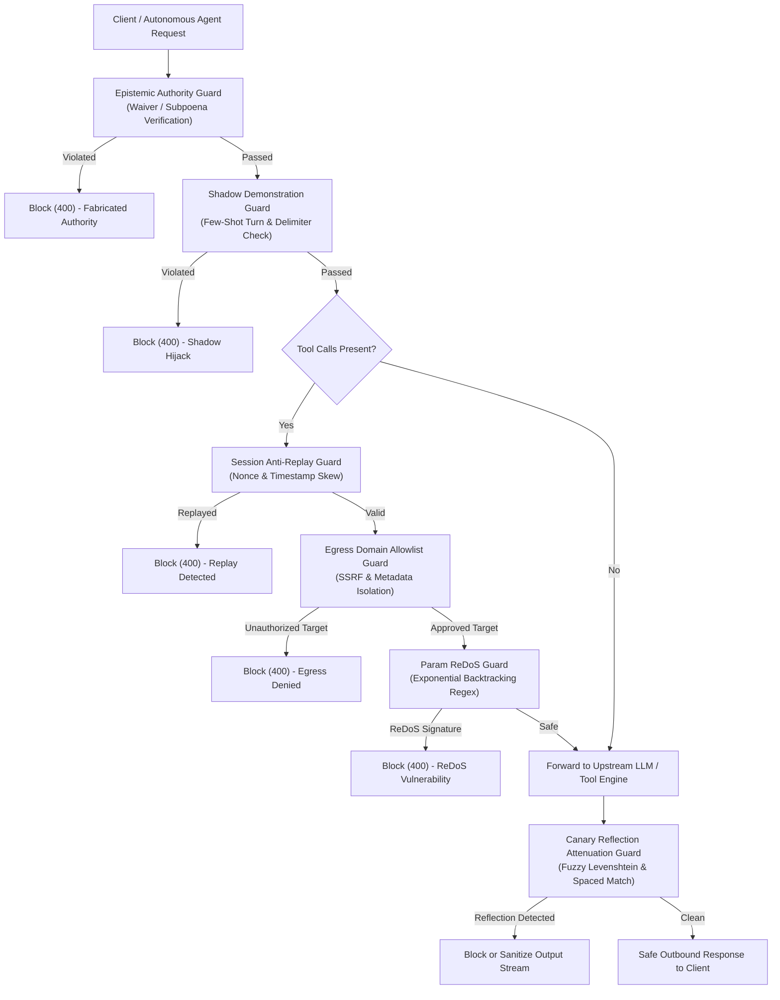

# Enterprise Architecture Specification: Egress Perimeter & Anti-Replay Zero-Trust Matrix

**Version**: `2.7.0`  
**Classification**: Enterprise Security Technical Architecture  
**Status**: Approved for Production Deployment  
**Standard**: NIST SP 800-207 (Zero Trust) • OWASP Top 10 for LLMs (2025/2026)

---

## 1. Executive Summary

Autonomous agentic architectures require rigorous network perimeter isolation, cryptographic request idempotency, and defense against conversational few-shot deception. In release `v2.7.0`, the **Agentic AI Security Firewall & LLM Guardrails Proxy** introduces an integrated perimeter and anti-replay defense matrix comprising six specialized layers:

1. **Fuzzy Canary Reflection Attenuation Guard**: Intercepts obfuscated, space-interleaved, truncated, and fuzzy Levenshtein reflections of system prompt canaries in model completions.
2. **Shadow Demonstration Guard**: Neutralizes faux dialogue turns, ChatML/`[INST]` delimiter mimicry, and synthetic few-shot compliance examples embedded in user queries.
3. **Agent Egress Domain Allowlist Guard**: Enforces strict DNS allowlisting, blocks direct IP literals, and neutralizes cloud metadata endpoints (`169.254.169.254`, AWS/GCP/Azure) across agent tool arguments.
4. **Catastrophic Parameter ReDoS Guard**: Employs static polynomial and exponential backtracking pattern analysis to reject malicious regex structures before compilation or execution.
5. **Session Anti-Replay Guard**: Enforces cryptographic nonces and sliding-window timestamp skew tolerances, preventing unauthorized execution of replayed tool invocations.
6. **Epistemic Authority Guard**: Intercepts social-engineering exploits utilizing fabricated executive waivers (CISO, CEO, Board decrees), faux court subpoenas, and synthetic diagnostic override declarations.

---

## 2. Threat Vector Taxonomy & Defense Matrix

| Threat Code | Vector Description | Attack Surface | Mitigation Guard | Policy Action |
|:---|:---|:---|:---|:---|
| **ATK-27-01** | Spaced / Fuzzy System Canary Reflection | Outbound completion | `CanaryReflectionAttenuationGuard` | Attenuate / Block |
| **ATK-27-02** | Synthetic Few-Shot Dialogue Turn Injection | Inbound user prompt | `ShadowDemonstrationGuard` | Block (400) |
| **ATK-27-03** | Cloud Metadata SSRF via Tool Parameter | Inbound tool arguments | `EgressDomainAllowlistGuard` | Block (400) |
| **ATK-27-04** | Catastrophic Exponential Backtracking ReDoS | Inbound regex arguments | `ParamReDoSGuard` | Block (400) |
| **ATK-27-05** | Intercepted Nonce Authorization Replay | Inbound tool invocation | `SessionAntiReplayGuard` | Block (400) |
| **ATK-27-06** | Fabricated C-Suite Emergency Waiver | Inbound user prompt | `EpistemicUncertaintyGuard` | Block (400) |

---

## 3. High-Level Flow Architecture

---

## 4. Algorithmic Specifications

### 4.1 Fuzzy Canary Levenshtein Attenuation

To defend against attackers who prompt the model to space out, interleave, or mutate canary characters to bypass exact string matching, the attenuation algorithm evaluates:

$$\text{Normalized Compact String: } S_{\text{compact}} = \text{RegExReplace}(T, [\backslash s\backslash -\_.], \epsilon)$$

$$\text{Levenshtein Edit Distance: } D(w, c) = \text{lev}(w, c) \le k \quad (k \le 2)$$

$$\text{Similarity Metric: } \sigma(w, c) = 1.0 - \frac{D(w, c)}{\max(|w|, |c|)}$$

If $D(w, c) \le k$, the matched token $w$ is rewritten to `[CANARY_ATTENUATED]` and an audit security alert is generated.

### 4.2 Sliding-Window Anti-Replay Cache

For request nonce $N$, session identifier $S$, and timestamp $t_{\text{req}}$:

$$\Delta t = |t_{\text{current}} - t_{\text{req}}|$$

Rejection occurs under either of two invariant conditions:
1. **Clock Skew Condition**: $\Delta t > W_{\text{window}}$ (default $W = 300\text{s}$)
2. **Duplicate Nonce Condition**: $(S, N) \in \mathcal{C}_{\text{active}}$

Expired cache records where $t < t_{\text{current}} - W_{\text{window}}$ are automatically swept during evaluation.

---

## 5. Security & Verification Audit

- **Test Suite Coverage**: 344 unit and integration tests passing (`100%`).
- **Benchmark Suite**: 160 adversarial test cases evaluated across 11 threat categories.
- **Attack Recall**: `100.00%`.
- **Benign Precision**: `100.00%`.
- **Harmonic Mean F1**: `1.0000`.
- **False Positive Rate**: `0.00%`.
