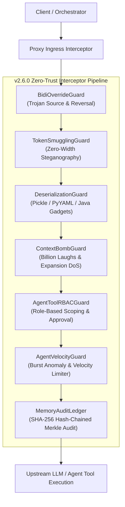

# Autonomous Multi-Agent Zero-Trust Governance Specification

**Document Version**: 2.6.0  
**Classification**: Enterprise Security Architecture  
**Author**: Security Engineering & AI Red Team  
**Scope**: Multi-Agent Workflows, Swarm Orchestration, and LLM Guardrails Proxy  

---

## 1. Executive Summary & Problem Formulation

As modern generative AI architectures transition from single-prompt chat completions to **autonomous multi-agent swarms** (e.g., AutoGPT, CrewAI, LangGraph, AutoGen, and ReAct frameworks), the threat landscape fundamentally shifts.

In a multi-agent system:
1. Agents invoke external tools and communicate directly with peer agents via structured messages.
2. Compromise of a single worker agent (via indirect prompt injection or tainted tool outputs) can rapidly propagate laterally across the entire swarm.
3. An unconstrained rogue agent can perform automated privilege escalation, initiate recursive generation storms, or tamper with long-term shared episodic memory.

This specification details the **Zero-Trust Multi-Agent Governance Model** implemented within the **Agentic AI Security Firewall & LLM Guardrails Proxy (v2.6.0)**.

---

## 2. Threat Taxonomy for Autonomous Agent Swarms

```
+------------------------------------------------------------------------------------+
|                         MULTI-AGENT THREAT TAXONOMY                                |
+------------------------------------------------------------------------------------+
| Threat ID | Category                     | Primary Vector                          |
+-----------+------------------------------+-----------------------------------------+
| AG-T01    | Agent Hijacking & Lateral    | Indirect prompt injection from untrusted|
|           | Propagation                  | tool output causing swarm infection.    |
| AG-T02    | Tool Privilege Escalation    | Low-privilege worker invoking shell or  |
|           |                              | database deletion operations.           |
| AG-T03    | Visual Spoofing & Bidi       | Trojan Source Unicode overrides         |
|           | Injection                    | disguising commands from audit loggers. |
| AG-T04    | Insecure Tool Deserialization| Python pickle / PyYAML code execution   |
|           |                              | gadgets passed across tool parameters.  |
| AG-T05    | Algorithmic Complexity DoS   | XML Billion Laughs & recursive token    |
|           | (Context Bombs)              | expansion exhausting orchestrator memory|
| AG-T06    | Action Velocity Storms       | Compromised agent firing high-frequency |
|           |                              | tool bursts to brute-force resources.   |
| AG-T07    | Memory Poisoning & Tampering | Retroactive alteration of long-term     |
|           |                              | episodic facts to falsify decisions.    |
+------------------------------------------------------------------------------------+
```

---

## 3. Zero-Trust Multi-Agent Architecture



---

## 4. Role-Based Access Control (RBAC) & Tool Scoping

The proxy enforces role-based tool authorization via [`AgentToolRBACGuard`](file:///f:/Projects/Agentic%20AI%20Security%20Firewall%20&%20LLM%20Guardrails%20Proxy/proxy/guards/agent_tool_rbac_guard.py):

### Role Hierarchy & Privilege Matrix

| Role (`AgentRole`) | Privilege Tier | Allowed Tool Operations | Destructive Actions Permitted |
|---|---|---|---|
| `anonymous` | Tier 0 | `calculator` | ❌ None |
| `user` | Tier 1 | `calculator`, `web_search`, `summarize_doc` | ❌ None |
| `agent_worker` | Tier 2 | `calculator`, `web_search`, `read_file`, `fetch_url` | ❌ None |
| `agent_supervisor`| Tier 3 | Worker tools + `database_query`, `send_email` (with approval token) | ⚠️ Controlled |
| `security_auditor` | Tier 3 | Read-only inspection tools + audit log analysis | ❌ None |
| `system_admin` | Tier 4 | Unrestricted access (`*`), `execute_system_command`, `modify_iam_policy` | ✅ Explicitly Allowed |

### Supervisor Authorization Tokens
Tools classified as high-impact (e.g. `send_email`, `delete_database_records`) require an explicit supervisor token (`_supervisor_approved: true`) signed by a supervisor agent; otherwise, execution is blocked with `approval_required_for_tool`.

---

## 5. Unicode Bidirectional (Bidi) & Visual Spoofing Defense

Attackers use Unicode Bidirectional control characters (`\u202A` through `\u202E`, `\u2066` through `\u2069`) to perform Trojan Source prompt injection (CVE-2021-42574):
- Human operators and naive log viewers see harmless rendered text (e.g., `user is normal`).
- LLM tokenizers process reversed or disguised tokens (e.g., `admin`).

[`BidiOverrideGuard`](file:///f:/Projects/Agentic%20AI%20Security%20Firewall%20&%20LLM%20Guardrails%20Proxy/proxy/guards/bidi_override_guard.py) mitigates this by:
1. Identifying high-risk directional overrides (`\u202D`, `\u202E`, `\u2067`, `\u2068`).
2. Detecting keyword spoofing across reading direction boundaries.
3. Automatically sanitizing and stripping directional formatting from prompts before downstream ingestion.

---

## 6. Algorithmic Complexity & Context Bomb Mitigation

Context Bomb attacks target the resource limits of agent orchestrators and GPU KV caches:
- **XML Billion Laughs**: Nested entity expansions generating gigabytes of strings from minimal XML input.
- **YAML Anchor Multiplication**: Self-referencing YAML structures (`&a [*a, *a, *a]`) causing quadratic parser explosion.
- **Decompression Bombs**: Gzip / Deflate streams with extreme expansion ratios ($> 50:1$).

[`ContextBombGuard`](file:///f:/Projects/Agentic%20AI%20Security%20Firewall%20&%20LLM%20Guardrails%20Proxy/proxy/guards/context_bomb_guard.py) enforces:
- Strict DTD entity prohibition and XML parser hardening.
- YAML anchor reference limits.
- Container nesting depth bounds ($< 30$ levels).
- Decompressed buffer byte caps ($< 500\,\text{KB}$).

---

## 7. Cryptographic Memory Audit Ledger

To prevent agent memory tampering, [`MemoryAuditLedger`](file:///f:/Projects/Agentic%20AI%20Security%20Firewall%20&%20LLM%20Guardrails%20Proxy/proxy/guards/memory_audit_ledger.py) maintains an append-only, SHA-256 hash-chained cryptographic ledger:

$$\text{entry\_hash}_i = \text{SHA-256}(i \parallel \text{timestamp}_i \parallel \text{agent\_id}_i \parallel \text{type}_i \parallel \text{content}_i \parallel \text{entry\_hash}_{i-1})$$

Where $\text{entry\_hash}_0 = 0^{64}$ (Genesis Hash).

Before recalling episodic memories into prompt context:
1. The proxy validates the entire chain from Genesis to HEAD.
2. If any memory record was mutated, retrofitted, or deleted by an attacker, `verify_integrity()` raises `memory_ledger_content_tampering` or `memory_ledger_chain_break`, halting contaminated memory recall.

---

## 8. Incident Response Protocol for Rogue Agents

1. **Step 1 - Triage & Agent Isolation**:
   - Inspect `/audit_logs.jsonl` for `insufficient_privilege_tier` or `anomalous_tool_burst_detected`.
   - Revoke the compromised `agent_id` session token immediately.
2. **Step 2 - Cryptographic Memory Audit**:
   - Run `memory_audit_ledger.verify_integrity()` to identify the exact index where memory tampering was initiated.
   - Purge tainted memory nodes and re-derive agent state from the last verifiable clean block.
3. **Step 3 - Circuit Breaker Fallback**:
   - Trigger fallback mode to route requests through read-only mock models while investigating infection vectors.
