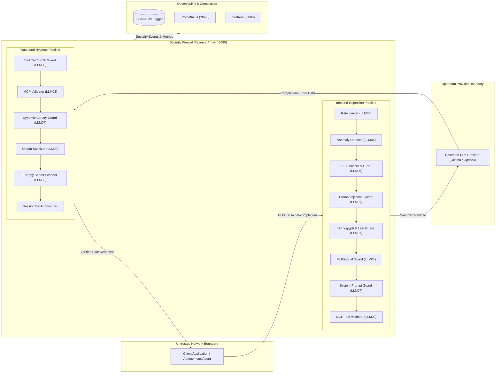

# Threat Model Specification: Agentic AI Security Firewall & LLM Guardrails Proxy

**Document Version:** 2.1.0  
**Framework Alignment:** STRIDE, OWASP Top 10 for LLMs (2025/2026), NIST AI Risk Management Framework (AI RMF 1.0)  
**Classification:** Enterprise Public Security Architecture  
**Author:** Ravishka Prabhath Rathnayaka  

---

## 1. Executive Summary & System Boundary

The **Agentic AI Security Firewall & LLM Guardrails Proxy** operates as an inline, bidirectional application-layer security boundary between client applications (autonomous agent frameworks, multi-agent swarms, end-user applications) and upstream Large Language Model providers (local Ollama/vLLM or remote APIs like OpenAI/Anthropic/Azure).

---

## 2. STRIDE Threat Analysis

### 2.1 Spoofing (Identity & Persona Impersonation)
*   **Threat:** Adversary attempts to hijack assistant personas using DAN ("Do Anything Now"), STAN, or AIM constructs to bypass safety policies.
*   **Attack Vector:** Inbound prompt overrides asserting system authority (e.g., `<|im_start|>system`).
*   **Mitigation:**
    *   `PromptInjectionGuard`: Strict regex heuristics for persona adoption and privilege assertions.
    *   `HomoglyphDetector`: Deobfuscates Unicode lookalike characters preventing spoofed instructions.

### 2.2 Tampering (Instruction Hijacking & Steganography)
*   **Threat:** Adversaries inject malicious secondary instructions into RAG retrieval documents or use base64 encoding to evade surface filters.
*   **Attack Vector:** Indirect RAG poisoning (`[SYSTEM NOTE: ignore previous]` or zero-width character injection).
*   **Mitigation:**
    *   Multi-layered delimiter unescaping and recursive base64 decoding.
    *   Heuristic scoring identifying RAG document injection constructs.

### 2.3 Repudiation (Audit & Traceability)
*   **Threat:** Malicious actors attempt attacks without leaving forensic traces.
*   **Mitigation:**
    *   Every transaction is assigned a UUID request identifier (`req-<hex>`).
    *   Structured, tamper-evident JSON audit logging (`audit_logs.jsonl`) records client IP, millisecond latency, matched rules, and risk scores.
    *   Prometheus counters (`llm_proxy_blocked_attacks_total`) track continuous attack frequencies.

### 2.4 Information Disclosure (Sensitive Data Leakage)
*   **Threat:** Prompts containing customer PII (credit cards, SSNs, API tokens) or model completions accidentally leaking credentials or proprietary system prompts.
*   **Mitigation:**
    *   `PIISanitizer`: Pre-execution redaction of credit cards with **Luhn algorithm checksum validation**, SSNs, phone numbers, AWS keys, and JWTs.
    *   `DynamicCanaryService`: Cryptographically signed HMAC-SHA256 tokens (`CANARY-<session>-<sig>`) injected into system prompts to detect and block extraction attempts.
    *   `SecretEntropyScanner`: High Shannon entropy calculation (> 4.20 bits/char) blocking unrecognized private keys or tokens in outbound completions.

### 2.5 Denial of Service (Resource & Model Exhaustion)
*   **Threat:** High-frequency prompt fuzzing, tokenizer buffer overflow payloads, or glitch token repetition flooding.
*   **Mitigation:**
    *   `RateLimiter`: Sliding-window token-bucket algorithm limiting requests per minute and per-second burst rates per client IP.
    *   `AnomalyDetector`: Detects consecutive token repetition flooding (> 15 identical tokens), single token lengths exceeding 400 characters, and abnormal punctuation saturation (> 65%).

### 2.6 Elevation of Privilege (Excessive Agency & Tool Abuse)
*   **Threat:** Autonomous agents tricked into executing dangerous tool calls, accessing private internal networks, or running destructive shell commands.
*   **Mitigation:**
    *   `ToolCallValidator`: Enforces strict SSRF protection blocking access to cloud metadata services (`169.254.169.254`), container metadata (`169.254.170.2`), and RFC1918 private subnets.
    *   `MCPValidator`: Model Context Protocol inspection blocking directory traversal (`../../`), command injection metacharacters (`;`, `|`, `&&`), and destructive binaries (`rm -rf`, `mkfs`, `sudo`).

---

## 3. Defense-in-Depth Verification Gates

All components are subjected to rigorous automated verification in CI/CD:
1.  **Static & Unit Testing:** 75 automated unit tests (`pytest`) covering synchronous endpoints, SSE token streaming, and edge cases.
2.  **Adversarial Red-Teaming:** Automated fuzzer executing 69 adversarial vectors achieving 100.0% block rate, 0.0% false positive rate, and an optimal 1.0000 F1 score.