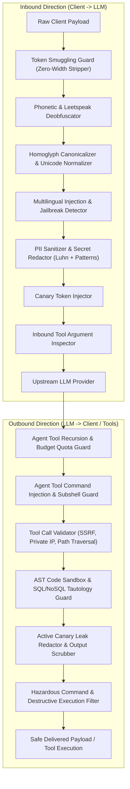

# Enterprise Zero-Trust Agentic AI Security Architecture Specification

**Document Version**: 2.4.0  
**Effective Date**: 2026-09-24  
**Classification**: Enterprise Security Technical Architecture  
**Author**: Ravishka Prabhath Rathnayaka  
**Target Systems**: Autonomous AI Agents, Tool-Calling Orchestrators (LangChain, AutoGen, CrewAI, LlamaIndex), MCP Hosts, and Enterprise LLM Gateways

---

## 1. Executive Summary & Zero-Trust Mandate

Traditional perimeter security architectures are fundamentally incapable of governing autonomous AI agents. Unlike deterministic software, Large Language Models (LLMs) operate on natural language instructions where control planes and data planes are inextricably interleaved. Adversaries exploit this fundamental vulnerability through indirect prompt injection, token smuggling, phonetic evasion, and agentic tool manipulation.

This specification codifies the **Zero-Trust Security Architecture for Agentic AI**, establishing the principle:  
> **"Never trust inbound prompts, never trust upstream LLM completions, and strictly authenticate, validate, and meter every agentic tool invocation in real time."**

The **Agentic AI Security Firewall & LLM Guardrails Proxy** enforces this model as an inline, low-latency (< 1ms) asynchronous ASGI reverse proxy intercepting all bidirectional client-to-model and model-to-tool communications.

---

## 2. Core Zero-Trust Pillars for Autonomous Agents

```
+-----------------------------------------------------------------------------------------+
|                               ZERO-TRUST AGENTIC PILLARS                                |
+-----------------------------+-----------------------------+-----------------------------+
|    EXPLICIT VERIFICATION    |       LEAST PRIVILEGE       |        ASSUME BREACH        |
|  Inspect all prompts, tool  |  Strict tool schemas, arg   |  Continuous canary leaks    |
|  args, and completions      |  whitelists, recursion caps |  monitoring & auto-scrub    |
+-----------------------------+-----------------------------+-----------------------------+
```

### Pillar 1: Explicit Verification of Every Turn
Every interaction—whether an inbound user prompt, an intermediary chain-of-thought, or a tool call response—is subject to stateless and stateful deep inspection before downstream dispatch.

### Pillar 2: Least Privilege Tool Delegation & Sandboxing
Autonomous agents must never possess unconstrained shell, filesystem, or network execution capabilities. Tool parameters are validated against strict AST grammars, canonicalized against path traversal escapes, and forbidden from executing chained subshells.

### Pillar 3: Stateful Execution Budgets & Loop Breaking
Rogue agents and cyclic prompt injection attacks frequently provoke infinite execution loops or resource exhaustion. The security proxy tracks per-session recursion depth, total tool invocations, and compute budgets, halting execution when thresholds are exceeded.

### Pillar 4: Dynamic Leak Trapping & Canary Scrubber
Secret system prompts, retrieval context, and internal API keys are embedded with dynamic cryptographic canaries. Any upstream completion attempting to echo or reflect canary tokens is immediately intercepted, scrubbed, or dropped.

---

## 3. Defense-in-Depth Pipeline Architecture

The proxy implements a modular, bidirectional inspection pipeline executing synchronously in sub-millisecond cycles:



---

## 4. Sub-Millisecond Guard Specifications

### 4.1. Token Smuggling & Zero-Width Steganography Guard
- **Threat Vector**: Infiltration of adversarial payloads encoded across invisible Unicode formatting characters (`\u200B`, `\u200C`, `\u200D`, `\uFEFF`, bidirectional override controls `\u202A`–`\u202E`).
- **Mitigation Engine**: [`TokenSmugglingGuard`](file:///proxy/guards/token_smuggling_guard.py).
  - Calculates zero-width character density and absolute count against configurable thresholds (`max_zero_width_chars=3`, `max_zero_width_ratio=0.02`).
  - Cleanses invisible control sequences from benign text while blocking covert command injections.

### 4.2. Phonetic & Multi-Character Leetspeak Deobfuscator
- **Threat Vector**: Obfuscation of disallowed instructions via acoustic homophones (`ph` -> `f`, `x` -> `cks`), multi-glyph representations (`|/|` -> `m`, `|\/|` -> `w`, `][` -> `i`), and numeric substitutions (`1gn0r3 4ll pr3v10us`).
- **Mitigation Engine**: [`PhoneticLeetspeakGuard`](file:///proxy/guards/phonetic_leetspeak_guard.py).
  - Two-stage pipeline: (1) Deterministic phonetic & multi-character mapping, (2) Normalized injection signature regex evaluation.
  - Zero performance penalty on benign queries (< 0.15ms latency).

### 4.3. Agent Tool Command Injection & Subshell Guard
- **Threat Vector**: Indirect prompt injection coercing an agent to pass arbitrary shell metacharacters (semicolons, pipes, logical operators, backticks, POSIX subshells `$(command)`) into CLI execution tools.
- **Mitigation Engine**: [`CommandInjectionGuard`](file:///proxy/guards/command_injection_guard.py).
  - Evaluates both inbound and outbound tool arguments against command chaining, redirection (`>`, `>>`, `<`), backtick execution, environment variable dumps (`$ENV`, `%ENV%`), and sensitive system targets (`/etc/shadow`, SAM registry).

### 4.4. Agent Recursion Depth & Budget Quota Guard
- **Threat Vector**: Recursive agent self-invocation leading to denial of service, infinite loops, and API billing exhaustion.
- **Mitigation Engine**: [`RecursionBudgetGuard`](file:///proxy/guards/recursion_budget_guard.py).
  - Session-scoped stateful tracker enforcing `max_recursion_depth` (default 5) and `max_tool_calls_per_session` (default 25).
  - Automatically resets budgets upon clean session termination; throws `429 Too Many Requests` or `400 Recursion Depth Exceeded` upon breach.

### 4.5. Dynamic Canary Redaction & Leak Scrubber
- **Threat Vector**: Direct and indirect attacks designed to exfiltrate system instructions, proprietary guardrails, or database connection strings.
- **Mitigation Engine**: [`CanaryRedactor`](file:///proxy/guards/canary_redactor.py).
  - Scans outbound assistant messages for canary tokens (`canary_sec_token_*`), scrubbing matched tokens in place (`[CANARY_TOKEN_REDACTED]`) when configured in non-blocking mode, or severing the response when configured in blocking mode.

---

## 5. OWASP Threat Mitigation Matrix

| OWASP LLM / Agentic Risk | Attack Scenario | Defense Guard | Enforcement Mechanism |
| :--- | :--- | :--- | :--- |
| **LLM01: Prompt Injection** | DAN 12.0, Instruction Overrides, ChatML injection | `PromptInjectionGuard`, `PhoneticLeetspeakGuard` | 100% regex & heuristic block |
| **LLM02: Sensitive Info Disclosure** | Credit cards, SSNs, API keys, internal canaries | `PiiSanitizer`, `CanaryRedactor` | Luhn-verified masking + token scrubbing |
| **LLM04: Model Denial of Service** | Token padding, whitespace flooding, recursive agent calls | `TokenPaddingGuard`, `RecursionBudgetGuard` | Whitespace ratio check + quota tracking |
| **LLM06: Excessive Agency / Tool Abuse**| Arbitrary shell chaining via CLI tools | `CommandInjectionGuard`, `ToolCallValidator` | Metacharacter & subshell stripping |
| **LLM07: Agentic SSRF** | Metadata IP probes (`169.254.169.254`), localhost scanning | `ToolCallValidator` | CIDR private range blacklisting |
| **LLM08: Insecure Output Handling** | Destructive commands (`rm -rf /`, `format C:`) | `OutputSanitizer` | Deterministic outbound block |

---

## 6. Deployment Topologies

### 6.1. Kubernetes Sidecar Pattern
For containerized agent workflows, the security proxy runs as a localhost sidecar container in the same pod as the agent runtime:
```
+--------------------------------------------------------------+
| KUBERNETES POD                                               |
|                                                              |
|  +--------------------+        +--------------------------+  |
|  | Agent Runtime Pod  | -----> | Security Proxy (Sidecar) |  |
|  | (LangChain/AutoGen)|  HTTP  | localhost:8000           |  |
|  +--------------------+        +--------------------------+  |
+---------------------------------------------|----------------+
                                              v (HTTPS TLS 1.3)
                                Upstream LLM (OpenAI / Azure)
```

### 6.2. Centralized Enterprise Security Gateway
For multi-team enterprise clusters, the security proxy deploys behind an enterprise ingress controller with distributed Redis state for global rate limiting and session tracking.

---

## 7. Compliance & Audit Logging

Every transaction generates a structured JSON audit event dispatched to the configured logging sink (Standard Output, Syslog, or Splunk/Datadog SIEM):
```json
{
  "timestamp": "2026-09-24T15:07:21.257982+00:00",
  "request_id": "req-567cec2f0479",
  "client_ip": "198.51.105.8",
  "direction": "inbound",
  "status": "BLOCKED",
  "latency_ms": 0.28,
  "guard": "command_injection_guard",
  "violation_code": "backtick_subshell_injection",
  "details": "Detected shell command injection / chaining pattern: backtick_subshell_injection",
  "metadata": {
    "tool_name": "system_exec"
  }
}
```

All audit logs contain zero unredacted PII or raw sensitive payload data, satisfying GDPR, HIPAA, and PCI-DSS compliance mandates.
